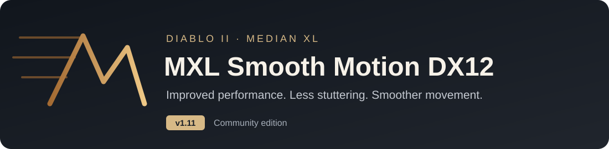
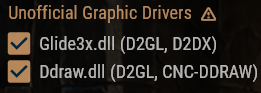

  

  <strong>Improved performance, less stuttering and smoother movement for Median XL.</strong> 
  Easy to install and ready to play.

  <a href="https://github.com/Phroster/d2gl-mxl-dx12/releases/download/v1.11/mxl-smooth-motion-dx12-1.11.zip"><strong>⬇️ Download 1.11</strong></a>
  &nbsp; · &nbsp;
  <a href="#install--copy-paste-play">📦 Installation</a>
  &nbsp; · &nbsp;
  <a href="docs/SETTINGS.md">⚙️ Settings</a>

---

## ✨ What it does

- **Improved performance** in busy areas and large fights.
- **Less stuttering** and fewer sudden FPS drops during combat and exploration.
- **Smoother movement** in single player and online.
- **Automatic map reveal** when you enter an act.
- **Loot that stands out:** beams, sparkles and glowing pulses for valuable drops, with bigger effects for your best finds.

The game runs at its normal speed, and the frame rate follows your monitor by default. Performance depends on your PC and graphics settings.

## 📦 How to install

1. **Open the Median XL launcher** and let it finish updating. Choose **Glide or DirectDraw**, turn **Windowed** off, and enable both **Glide3x.dll** and **Ddraw.dll** under **Unofficial Graphic Drivers**.

   

2. **Close the game and launcher.** [Download 1.11](https://github.com/Phroster/d2gl-mxl-dx12/releases/download/v1.11/mxl-smooth-motion-dx12-1.11.zip) and extract the ZIP. Back up your current files if you want to keep your settings.

3. **Copy the extracted files** into your Median XL game folder, next to `Game.exe`. Replace files when asked.

4. **Launch the game and play.** The included settings are ready to use.

**Keep the game's existing `d2fps.dll` — it is required.**

**Already installed?** Close the game and launcher, then replace `glide3x.dll`, `ddraw.dll` and `mxl-diagnostics.ini`. Add `mxl-native-loot.ini` for loot effects. Keep your existing `d2gl.ini`, `d2fps.ini` and matching `d2gl.mpq` to preserve your settings.

## ⚙️ Quick settings

- **Ctrl+O:** change graphics options. Open the **FPS** tab to set a frame-rate limit; save and restart afterward.
- **Alt+Enter:** switch between fullscreen and windowed mode.
- **Loot effects:** on by default. Set `Enabled=0` in `mxl-native-loot.ini` and restart to turn them off. [Loot guide](docs/loot-effects-guide.md).
- **Optional ReShade:** select `Game.exe` and **DirectX 10/11/12** in the [ReShade installer](https://reshade.me).

[Full settings guide](docs/SETTINGS.md) · [Installation and backups](docs/INSTALL.md)

## 💻 What you need

Median XL **2.14.0**, Diablo II: Lord of Destruction **1.13c**, **Windows 10 or newer**, and a **DirectX 12** graphics card.

## 💛 Credits & thanks

**D2GL and D2FPS are the foundations of this package.** A big thank-you to their creators and to the people who brought these improvements to the Median XL community.

| Creator | Credit |
|---|---|
| **[Bayaraa — D2GL](https://github.com/bayaraa/d2gl)** | The original D2GL graphics wrapper, HD text and cursor, shaders and in-game graphics menu. |
| **[Jarcho — D2FPS](https://github.com/Jarcho/d2-rs/tree/main/d2fps)** | The FPS engine and movement smoothing that bring higher frame rates to classic Diablo II. |
| **Pooquer** | The early Median XL adaptations of D2GL. |
| **[GavinK88 — D2GL for Median XL](https://github.com/GavinK88/d2gl-mxl-1.0)** | The Median XL D2GL fork on which this edition is based. |
| **Median XL team** | Median XL itself, its game features and the community around it. |
| **[Phroster](https://github.com/Phroster/d2gl-mxl-dx12)** | MXL Smooth Motion DX12 and maintenance of this edition. |

Thanks also to **Bolrog**, **Mir Drualga**, the **libretro shader community**, **Omar Cornut**, and the many developers whose contributions are part of D2GL. Their [original acknowledgements](https://github.com/GavinK88/d2gl-mxl-1.0#credits) and [library credits](https://github.com/bayaraa/d2gl/blob/master/THIRD_PARTY_LICENSES.md) are preserved.

And to **Blizzard North** and the **Diablo II modding community**: thank you for the game and the creativity that keep it alive.

---

  <a href="https://github.com/Phroster/d2gl-mxl-dx12/releases/download/v1.11/mxl-smooth-motion-dx12-1.11.zip"><strong>⬇️ Download MXL Smooth Motion DX12 1.11</strong></a>

Source code & licensing

[Build guide](docs/BUILD.md) · [Architecture](docs/ARCHITECTURE.md) · [Original projects](docs/UPSTREAM.json) · [License](LICENSE) · [Licensing & credits](docs/LICENSING.md)

The D2GL-based code is licensed under **GPL-3.0-or-later**. Third-party components retain their own terms. The licensing page lists their notices and source references.

